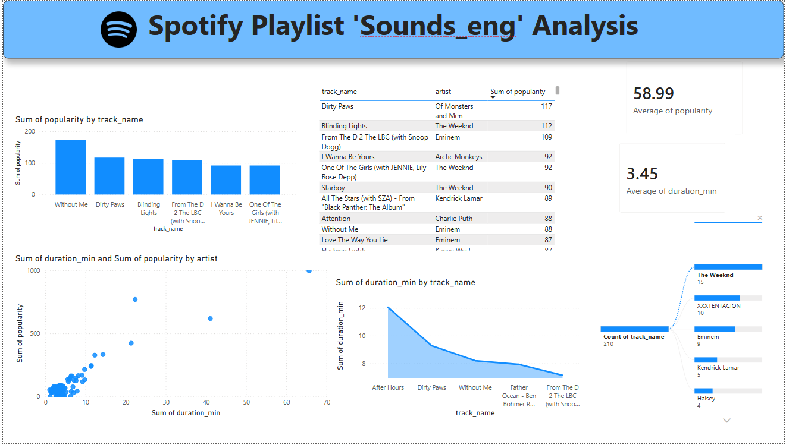

# 🎵 Spotify Playlist "Sounds_eng" Analysis

## Project Overview
This project focuses on analyzing the Spotify playlist **“Sounds_eng”** to understand song popularity, artist contribution, and track duration patterns.  
Using **SQL, Python, and Power BI**, the project extracts insights from playlist data and presents them through an interactive dashboard.

The analysis answers key questions such as:
- Which tracks and artists are the most popular?
- How does song duration relate to popularity?
- Which artists dominate the playlist?
- What are the overall popularity and duration trends?

---

## Objectives
- Analyze Spotify playlist data using SQL and Python
- Perform Exploratory Data Analysis (EDA) on song popularity and duration
- Identify top-performing tracks and artists
- Study the relationship between song duration and popularity
- Build an interactive Power BI dashboard for visualization and storytelling

---

##  Dataset Description
The dataset contains Spotify playlist-level information with the following key attributes:

| Column Name     | Description |
|-----------------|------------|
| track_name      | Name of the song |
| artist          | Artist name |
| popularity      | Spotify popularity score |
| duration_min    | Track duration in minutes |
| album           | Album name |

---

## SQL Analysis
File: [play_list_analysis](playlist_analysis.sql)

SQL was used to:
- Retrieve top tracks by popularity
- Identify top artists based on total popularity
- Calculate average popularity and average track duration
- Perform aggregations required for dashboard KPIs

---

##  Python Analysis (EDA)
Files:
- [Retriving_data_connecting_database](spotify_pr5.ipynb)
- [playlist_analysis](playlist_analysis.ipynb)

Python libraries used:
- Pandas
- Matplotlib
- Seaborn

Key EDA performed:
- Distribution of song popularity
- Distribution of track duration
- Artist-wise popularity comparison
- Relationship between duration and popularity

Python was also used to validate SQL results and prepare data for visualization.

---

## Power BI Dashboard

The Power BI dashboard provides an interactive view of the playlist analysis.

### Key KPIs
- **Average Popularity:** 58.99
- **Average Track Duration:** 3.45 minutes

---

## Key Insights
- Certain tracks consistently show higher popularity across the playlist
- A small group of artists contribute a large share of total popularity
- Track duration does not strongly dictate popularity, indicating listener preference is influenced more by artist and song appeal
- The playlist is dominated by a few recurring artists such as *The Weeknd* and *Eminem*

---

## Conclusion
This project demonstrates an end-to-end **data analytics workflow**, combining SQL querying, Python-based EDA, and Power BI visualization.  
It highlights the ability to transform raw playlist data into meaningful insights and interactive dashboards.

---